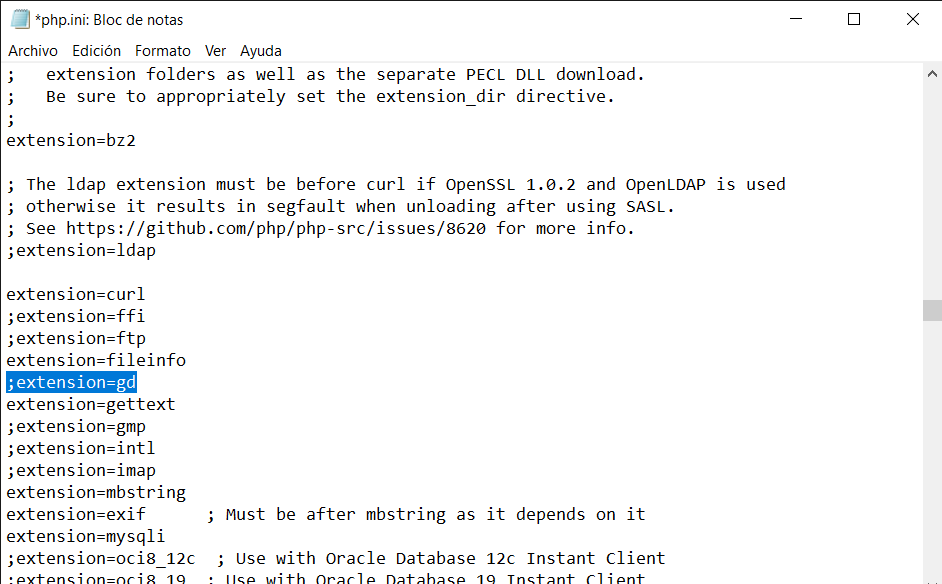
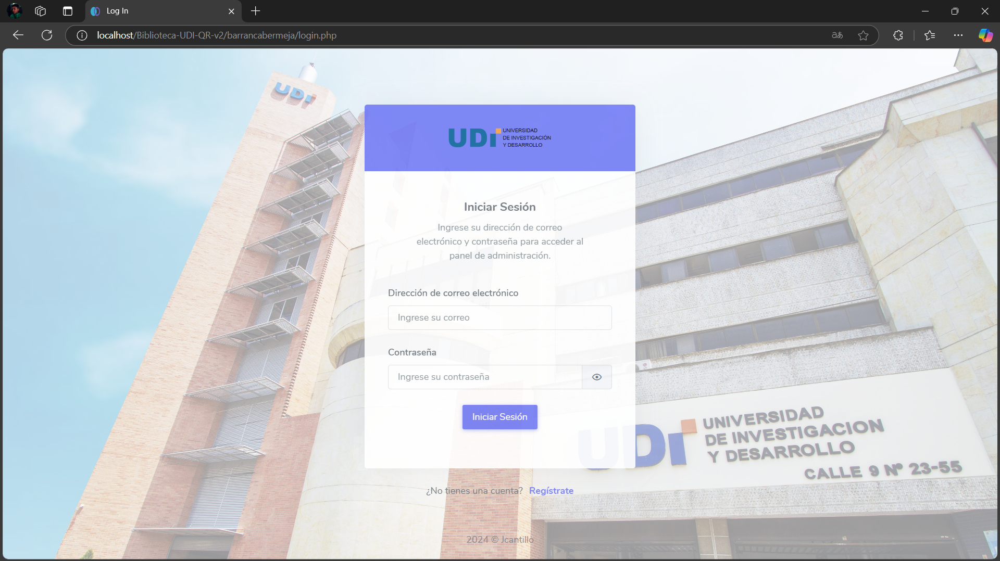
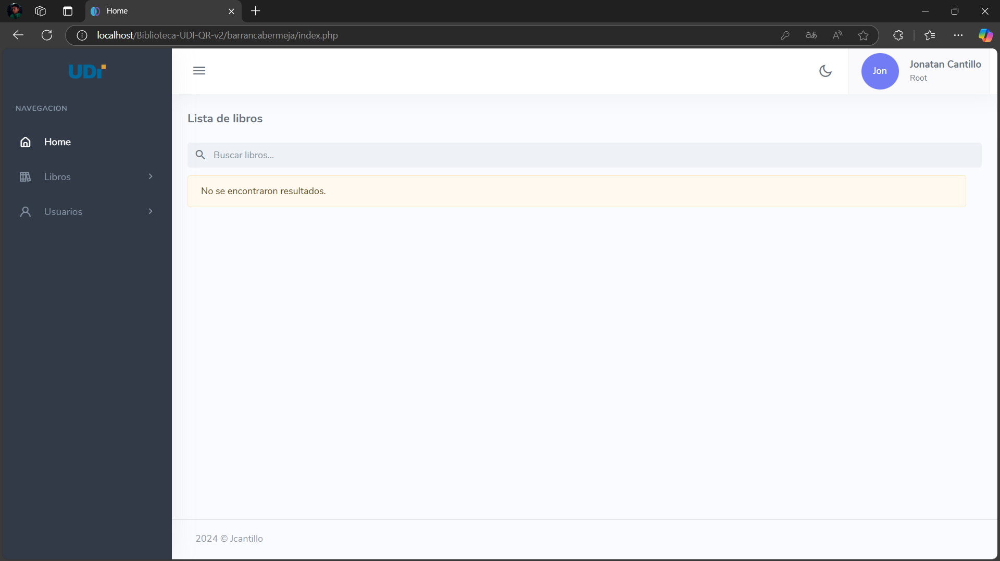
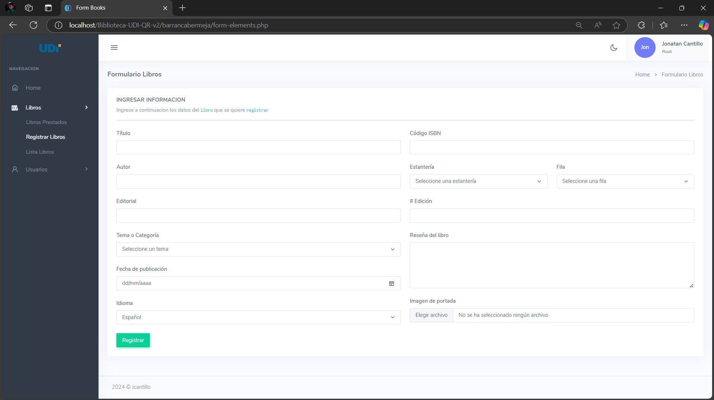
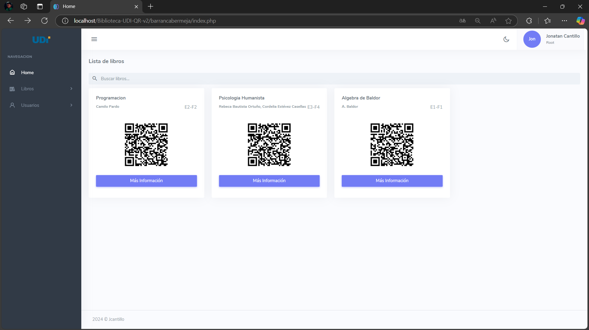
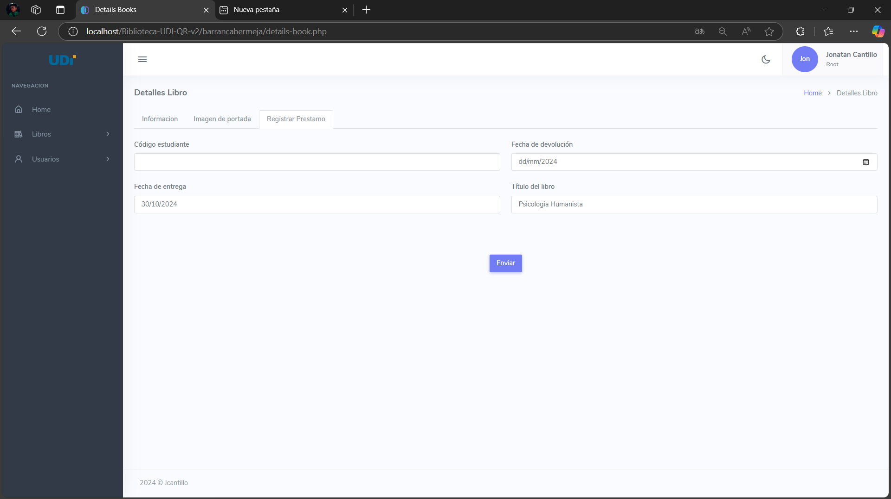
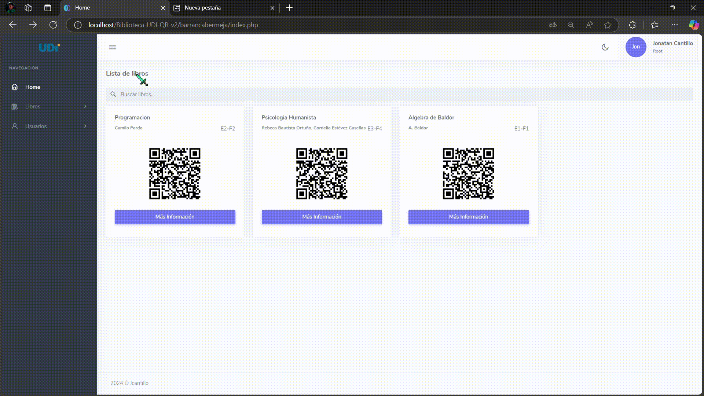

# Biblioteca UDI - Sistema de Administración de Libros 📚 

Este proyecto es un sistema de administración de libros desarrollado para la **Biblioteca de la Universidad de Desarrollo e Investigación (UDI)** en Barrancabermeja. Su objetivo es mejorar la eficiencia en la gestión de préstamos y la localización de libros, integrando el uso de **códigos QR** para facilitar el acceso a la información de cada libro.

## 📌 Descripción del Proyecto

El sistema permite que tanto estudiantes como administradores gestionen y consulten la disponibilidad de libros. Con la lectura de códigos QR generados automáticamente al registrar los libros, los usuarios pueden obtener información detallada de cada libro en tiempo real. Está dirigido principalmente a los **bibliotecarios** (administradores del sistema) y a los **estudiantes de la UDI** que desean consultar, pedir prestado y devolver libros de manera eficiente.

## 🚀 Funcionalidades

- **Gestión de Usuarios**:
  - Los usuarios se dividen en tres roles: **Root**, **Admin** y **Estudiante**.
  - `Root`: Tiene permisos para gestionar usuarios, roles y libros.
  - `Admin`: Gestiona libros y préstamos, consulta inventario, y realiza acciones de préstamo y devolución.
  - `Estudiante`: Consulta la disponibilidad de libros, visualiza su perfil y realiza devoluciones.

- **Gestión de Libros**:
  - Registro de nuevos libros con detalles como título, autor, editorial, categoría, y edición.
  - Generación de códigos QR para cada libro, que permite el acceso directo a su información.
  - Clasificación de libros por estantería y fila, asignando una ubicación física en la biblioteca.
  - Actualización del estado del libro (Disponible, Prestado, Inhabilitado).

- **Sistema de Préstamos**:
  - Flujo de préstamos desde la solicitud hasta la devolución.
  - Los libros prestados se registran con fecha de préstamo y fecha de vencimiento.
  - Visualización del historial de préstamos, tanto por el administrador como por el estudiante.

- **Búsqueda Dinámica**:
  - Funcionalidad de búsqueda rápida y filtrada, disponible tanto para libros prestados como para libros disponibles.

## 🎯 Puntos Clave

1. **Inicio de Sesión y Roles**:
   - Distintos permisos y funcionalidades según el rol del usuario. Ademas de activacion o inactivacion de usuarios.
2. **Código QR**:
   - Cada libro tiene un QR único que redirige a la página con su información completa.
3. **Registro de Ubicación Física**:
   - Los libros son ubicados físicamente en estanterías y filas específicas, lo que facilita su localización.
4. **Flujo de Préstamos**:
   - Registro detallado de la actividad de préstamo y devolución de libros.
5. **Búsqueda Dinámica**:
   - Búsqueda rápida por título, autor o ISBN desde cualquier vista de libros.

## 🛠 Instalación

1. **Clona el repositorio**: 
```
git clone https://github.com/Jonatan1014/Biblioteca-UDI-QR-v2.git
```
2. **Configura XAMPP**:
   - Descarga e instala [XAMPP](https://sourceforge.net/projects/xampp/files/XAMPP%20Windows/8.2.12/xampp-windows-x64-8.2.12-0-VS16-installer.exe).
   - Inicia la aplicacion. Entra en donde dice `Config` de `Apache` y busca `PHP (php.ini)`. Abre el archivo y ejecuta `CTRL + b` y busca `extension=gd` y quita el `;` del principio de la linea. Guarda y cierra el archivo. Reinicia el servidor de Apache.
   - 
   - Coloca los archivos del repositorio en `xampp/htdocs`.
3. **Intalacion de Composer**
   - Descarga e instala [Composer](https://getcomposer.org/download/).
   - Ejecuta el archivo `Composer-Setup.exe`.
   - Install for all users.
   - Dar permisos de administrador a composer.
   - Paso a paso de instalacion: `Next`, `Add this PHP to your path`, `Next`, `Next`, `Install`, `Next`, `Finish`.
5. **Instalacion de librerias**:
   - Para instalar las librerias `QrCode` y `PngWriter` para la trata de imagenes y genrar codigo QR ejecute los sigientes comandos.
   - Entrar a `Biblioteca-UDI-QR-V2/barrancabermeja` y abrir una terminal.
   ```
   composer require endroid/qr-code

   ```

4. **Configura la Base de Datos**:
   - Inicia Apache y MySQL en XAMPP.
   - Abre `phpMyAdmin` y crea una base de datos llamada `libroqr`.
   - Importa el archivo `estructura_bd.sql` (ubicado en `BIBLIOTECA-UDI-QR-V2/barrancabermeja/includes/CRUD/estructura bd.sql`).
5. **Ejecutar la aplicacion**:
   - Abre un navegador y accede a `localhost/Biblioteca-UDI-QR-V2/barrancabermeja`.

## 📷 Imágenes del Sistema

Aquí tienes algunos puntos clave con sus respectivas capturas de pantalla:

1. **Inicio de Sesión**:
   - 

2. **Vista Principal - Admin**:
   - 

3. **Registro de Nuevo Libro con QR**:
   - 

4. **Visualización del QR Generado**:
   - 

5. **Visualización de formulario de prestamo**:
   - 

6. **Búsqueda Dinámica de Libros**:
   - 

---

## 📄 Licencia

Este proyecto es de uso exclusivo de la **Universidad de Desarrollo e Investigación (UDI)** y se distribuye bajo una licencia de uso académico y no comercial.

## 🙌 Contribuciones

Si deseas contribuir, por favor, realiza un **pull request** o abre un **issue** en GitHub para sugerencias y mejoras.

--- 

